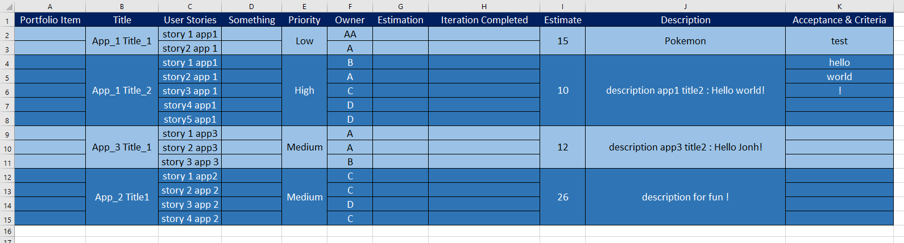

# 🚀 Generate part of documentation from SAFE/Agile data 🚀 <!-- omit in TOC -->

- [Input data](#input-data)
- [Output](#output)
  - [Main page](#main-page)
  - [Application page](#application-page)
  - [Feature page](#feature-page)
- [Getting started](#getting-started)
  - [Navigator extension](#navigator-extension)
- [Stack](#stack)
- [Why this project](#why-this-project)
- [Cheatsheet](#cheatsheet)
  - [handling document](#handling-document)
    - [Copy a document on a other document](#copy-a-document-on-a-other-document)
    - [Test if a file exist already or not](#test-if-a-file-exist-already-or-not)
    - [Create folder](#create-folder)
  - [Pandas](#pandas)
    - [Clean our entry data](#clean-our-entry-data)
    - [check if a value is NaN](#check-if-a-value-is-nan)
    - [remove duplicate from list or array](#remove-duplicate-from-list-or-array)


## Input data
I use a CSV file containing data from a SAFE / Agile project. So on the screen you can see fake data :



* __Title__ = Name of the feature
* __User Stories__ = Name of the user stories
* __Owner__ = Who is in charge of this stories
* __Priority__ = importance of the feature
* __Description__ = description for the feature
* __Estimate__ = Estimation for realise the feature
* __Estimation__ = Estimation for realise the story 
* __Acceptance & criteria__ = Acceptance and criteria for the feature

So basically we have current data on a SAFE / agile project with current way to handle it using excel document or google sheet document. We export this sheet on CSV format and we use it as entries data for generate a part of our documentation on every PI (planning iteration).

<br>
<br>

____

## Output
We have 3 types of pages in output :
* __Main page__ with all summaries (grouping all application)
* __Application page__ with specific summary for the application
* __Feature page__ with technical information and conclusion for BO & management 

Also we generate table and link from CSV file, note that we have a behaviour which will not delete the previous content already generated, that's mean if we launch again the programme then the __Feature page__ will not be changed, if we launch again the program with a new file in entries then all the tab will be update with new row but the previous row will be here of course. This behaviour fit well with iteration workflow (agile workflow) with PI (Planning iteration) wich group many iteration.

With this folder structure : 

```python
.
├── Application-1 
│   ├── Commit
│   │   ├── App-1-Title-1 
│   │   │   └── Readme.md #feature page
│   │   └── App-1-Title-2
│   │       └── Readme.md
│   └── Readme.md #application page
├── Application-2
│   ├── Commit
│   │   └── App-2-Title1
│   │       └── Readme.md
│   └── Readme.md
├── Application-3
│   ├── Commit
│   │   └── App-3-Title-1
│   │       └── Readme.md
│   └── Readme.md
├── Readme.md #main page
└── style.css #style for all Readme.md
```

<br>

Note style are handled by :
* __``style.html``__
* __``style.css``__

<br>

### Main page 


<br>

### Application page 


<br>

### Feature page


<br>


Note : Expand technical documentation can be extended so when a BO or manager read this documentation they can skip it and just read conclusion for each story. But if they want read more technical explaination they can do it also. 

<br>
<br>

___

## Getting started 

According to the [pandas documentation](https://pandas.pydata.org/docs/getting_started/index.html#getting-started) install pandas libraries with the following command :
```python
pip install pandas
```
Or 

```python
conda install pandas
```

<br>

This script work on __``windows``__ devices but if you want to try this script on mac or linux device you will need to change some variable :
```python
# define path and file for input data and separator for CSV format
path = "./"
fileCSV = "data3.csv"
separator = ";"
```
And
```python
# path where the doc will be created
creation_path = "./"
parent_folder = "documentation"
sep_sys = "/"
```

### Navigator extension

To obtain exactly the same view I use this extension : [extension from simov : markdwon viewer](https://github.com/simov/markdown-viewer#advanced-options)
Install: 
* [Chrome](https://chrome.google.com/webstore/detail/markdown-viewer/ckkdlimhmcjmikdlpkmbgfkaikojcbjk) 
* [Firefox](https://addons.mozilla.org/en-US/firefox/addon/markdown-viewer-chrome/)
* [Opera](https://addons.opera.com/en/extensions/details/install-chrome-extensions/)
* [Edge](https://microsoftedge.microsoft.com/addons/detail/markdown-viewer/cgfmehpekedojlmjepoimbfcafopimdg)

But of course you can use Visual studio code or directly see on github/gitlab your documentation too, the difference will be that you will not have table of content on side. And for github/gitlab you will also not see mermaid graph directly or embed content. Because for security reason script and embed content are disable on github/gitlab same thing for visual studio code butr visual studio code allow mermaid graph out of the box.

<details>
<summary>Parameters for markdown viewer : Compiler</summary>

* Compiler 


</details>

<details>
<summary>Parameters for markdown viewer : Theme</summary>

* Theme


</details>

<details>
<summary>Parameters for markdown viewer : Content</summary>

* Content


</details>

Note : the author of markdown viewer certified that he don't use our data with him extension and him code source can be found on him github so that comply with security policies.

<br>

Tab showing limitation depending on what Solution you use to see the documentation :


|Solution|Mermaid graph|Embed document & Script|custom css|code copy to clipboard|code coloration|
|---|---|---|---|---|---|
|github|<div align="center">✔️</div>|<div align="center">❌</div>|<div align="center">✔️</div>|<div align="center">✔️</div>|<div align="center">✔️</div>|
|gitlab|<div align="center">✔️</div>|<div align="center">❌<br>note : work for video and sound only</div>|<div align="center">✔️</div>|<div align="center">✔️</div>|<div align="center">✔️</div>|
|markdown viewer extension|<div align="center">✔️</div>|<div align="center">✔️</div>|<div align="center">✔️</div>|<div align="center">❌</div>|<div align="center">✔️</div>|
|visual studio code|<div align="center">✔️</div>|<div align="center">✔️</div>|<div align="center">✔️</div>|<div align="center">❌</div>|<div align="center">✔️</div>|


Note : The limitation was due to the `Solution` you use, for example gitlab/github sanitirize our .md file so script and iframe will not work. For gitlab you can embed video / sound but you can't embed google slide, google doc... With visual studio code and markdown viewer you can embed document and script but unfortunaly for the moment we can't use code copy to clipboard like in gitlab or github. 

Also for custom css on github/gitlab you should write your css inside ``style.html`` using `style` html balise instead of reference.

Also on visual studio code you can use many previewer enhancement :
* [Markdown Preview Github Styling [Matt Bierner]](https://marketplace.visualstudio.com/items?itemName=bierner.markdown-preview-github-styles) that's the one i use. Simply this extension give you the same look as github document and this extension will not extend your previewer so it's more near to what you will see on gitlab / github.
* [Markdown Preview Enhanced [Yiyi yang]](https://marketplace.visualstudio.com/items?itemName=shd101wyy.markdown-preview-enhanced). An other previewer enhancer, this one is good but if you use this one you will need to use `style.html` and `style` balise for your custom css. Also the theme is a little bit different than github so inside `style1.html` i put some reference for some css. This extension also extend your previewer with more feature than gitlab / github in term of embediing document because you can embed pdf, jpg, csv, and code from online source and local source with ``@import file`` but if you use that, this kind of embeding will not work on your browser extension, and also not work on gitlab/github, same thing if you use different diagram wich is not handled by gitlab / github. [documentation](https://shd101wyy.github.io/markdown-preview-enhanced/#/)

Note : The 2 previewers can be use together, just you will have 2 buttons for choose wich previewer you want to use. 

<br>
<br>


___

## Stack
* python
* pandas (data science, data analyse)
* OS
* automatisation (I/O file : generating document)

<br>

___
## Why this project
I simply want to automate some task to save time and be more productif. This little project was created with this kind of mindset. Also i want to learn and practice a little with __``Pandas``__ wich is a popular lib for python data science and data analyse. Because that's one of the topic i really like. For me analysing data mean that you use some entries data to provide an output. It's usefull for analyse and find axies for improvement purpose. But that's also mean that you can use this entries data for generate document, mail, report etc... with the same improvement goal.

Also I want notice that this little project work, but it's clearly POC (proof of concept) project for praétical purpose. Because of that the project is clearly not properly write in term of good practicing. But i retrieve from it a good insight and clue about this topics. 

Of course if I need to do again a similar project then i will certainly do the thing differently for allowing more parameters and have a code more reusable and more factorised. But in my case i don't really find that's a requirement because my entries data will not change that much even if I change for other project. Despite that fact I write on my __``readme.md``__ some usefull thing i learn during this project inside Cheatsheet. 

<br>
<br>

___

## Cheatsheet

### handling document

No|Modes|Description
---|---|---
1|r|Opens a file for reading only. The file pointer is placed at the beginning of the file. This is the default mode.
2|rb|Opens a file for reading only in binary format. The file pointer is placed at the beginning of the file. This is the default mode.
3|r+|Opens a file for both reading and writing. The file pointer placed at the beginning of the file.
4|rb+|Opens a file for both reading and writing in binary format. The file pointer placed at the beginning of the file.
5|w|Opens a file for writing only. Overwrites the file if the file exists. If the file does not exist, creates a new file for writing.
6|wb|Opens a file for writing only in binary format. Overwrites the file if the file exists. If the file does not exist, creates a new file for writing.
7|w+|Opens a file for both writing and reading. Overwrites the existing file if the file exists. If the file does not exist, creates a new file for reading and writing.
8|wb+|Opens a file for both writing and reading in binary format. Overwrites the existing file if the file exists. If the file does not exist, creates a new file for reading and writing.
9|a|Opens a file for appending. The file pointer is at the end of the file if the file exists. That is, the file is in the append mode. If the file does not exist, it creates a new file for writing.
10|ab|Opens a file for appending in binary format. The file pointer is at the end of the file if the file exists. That is, the file is in the append mode. If the file does not exist, it creates a new file for writing.
11|a+|Opens a file for both appending and reading. The file pointer is at the end of the file if the file exists. The file opens in the append mode. If the file does not exist, it creates a new file for reading and writing.
12|ab+|Opens a file for both appending and reading in binary format. The file pointer is at the end of the file if the file exists. The file opens in the append mode. If the file does not exist, it creates a new file for reading and writing.

[source for table](https://www.tutorialspoint.com/python/python_files_io.htm)

But I find some of them really usefull :
* __r__ : for reading a file and copy a file inside an other file
* __w__ : write a file with overwriting the previous content as behaviour
* __a__ : write a file but append the content at the end of the document as behaviour

Other are combination of them or binary version.

<br>

#### Copy a document on a other document
* w : document in input
* f : document in output
```python
f = open(path + "style.css", "w")
style_css_path = creation_path + "style.css"
# print(temp_path)
w = open(style_css_path, "r")

for line in w.readlines():
    f.writelines(line)

w.close()
f.close()
```

Note : 
If i want to do a program like this again, then i will certainly use more intermediate file because that's certainly the best way to do something working for iterating workflow. In my case i use w, r, a combinate with test if the document exist already or not and it's enough for my purpose but for more complexe project, intermediate document is certainly the way to do it.

<br>

#### Test if a file exist already or not

```python
    if(os.path.isfile(path)==False):
```

<br>

#### Create folder 
```python
def create_folder(repertoire):
    #print(repertoire)
    if not os.path.exists(repertoire):
        os.makedirs(repertoire)
    while not os.path.exists(repertoire):
        time.sleep(0.5)
```

<br>
<br>

___
### Pandas
#### Clean our entry data


For pandas as you can see, we use CSV data. And basically CSV and panda can't handling merge data out of the box so when we read our document to create a dataframe we obtain that :
```
    Portfolio Item  ... Acceptance & Criteria
0              NaN  ...                  test
1              NaN  ...                   NaN
2              NaN  ...                 hello
3              NaN  ...                 world
4              NaN  ...                     !
5              NaN  ...                   NaN
6              NaN  ...                   NaN
7              NaN  ...                   NaN
8              NaN  ...                   NaN
9              NaN  ...                   NaN
10             NaN  ...                   NaN
11             NaN  ...                   NaN
12             NaN  ...                   NaN
13             NaN  ...                   NaN
```
So a lot of data which is not relevant but also a lot of empty data with __``NaN``__ value. Because of that we clean this data first with our own method to obtain that :
```
                     Title  ...  Acceptance & Criteria
0        [App_1 Title_1, ]  ...               [test, ]
1  [App_1 Title_2, , , , ]  ...  [hello, world, !, , ]
2      [App_3 Title_1, , ]  ...                 [, , ]
3     [App_2 Title1, , , ]  ...               [, , , ]
```

And to do it we need to perform some task on our dataframe :
<details>
<summary>remove useless collumn + merge data inside tab</summary>

remove useless collumn
```python
# remove useless collumn from a dataframe
def dataframe_remove_collumn(dataframe, keepCollumnArray):
    for element in dataframe:
        test_contain = False
        for collumn in keepCollumnArray:
            if(element == collumn):
                test_contain = True

        if(test_contain == False):
            dataframe = dataframe.drop([element], axis=1)
    return dataframe
```
and after merge data :
```python
# clean up dataframe
def dataframe_clean_up(dataframe, mainCollumnName):
    init_Col = 0
    for i in range(0, len(dataframe[mainCollumnName])):
        #print("hello")
        #print(dataframe[mainCollumnName][i])
        #print(dataframe[mainCollumnName][i] == dataframe[mainCollumnName][i])
        # check NaN value
        if(dataframe[mainCollumnName][i] == dataframe[mainCollumnName][i]):
            init_Col = i
            for element in dataframe:
                #print(element)
                try:
                    if(isNan(dataframe[element][init_Col])):
                        dataframe[element][init_Col] = [""]
                    else:
                        dataframe[element][init_Col] = [str(dataframe[element][init_Col])]
                except:
                    dataframe[element][init_Col] = [""]
                    pass
        else:
            for element in dataframe:
                #print(element)
                try:
                    #print(dataframe[element][init_Col])
                    array = dataframe[element][init_Col]
                    if(isNan(array)):
                        array = [""]
                    else:
                        if(isNan(dataframe[element][i])):
                            #print("do nothing")
                            array.append("")
                        else:
                            array.append(str(dataframe[element][i]))
                    dataframe[element][init_Col] = array
                except:
                    pass

    #print(dataframe)
    #dataframe = dataframe.dropna()
    return dataframe
```

result :
```
                      Title  ...  Acceptance & Criteria
0         [App_1 Title_1, ]  ...               [test, ]
1                       NaN  ...                    NaN
2   [App_1 Title_2, , , , ]  ...  [hello, world, !, , ]
3                       NaN  ...                  world
4                       NaN  ...                      !
5                       NaN  ...                    NaN
6                       NaN  ...                    NaN
7       [App_3 Title_1, , ]  ...                 [, , ]
8                       NaN  ...                    NaN
9                       NaN  ...                    NaN
10     [App_2 Title1, , , ]  ...               [, , , ]
11                      NaN  ...                    NaN
12                      NaN  ...                    NaN
13                      NaN  ...                    NaN
```

</details>
<details>
<summary>remove line with NaN value</summary>

remove useless collumn
```python
    dataframe = dataframe.dropna()
```

result :
```
                     Title  ...  Acceptance & Criteria
0        [App_1 Title_1, ]  ...               [test, ]
2  [App_1 Title_2, , , , ]  ...  [hello, world, !, , ]
7      [App_3 Title_1, , ]  ...                 [, , ]
10     [App_2 Title1, , , ]  ...               [, , , ]
```

</details>
<details>
<summary>re-indexing our dataframe</summary>

remove useless collumn
```python
dataframe = dataframe.reset_index()
```

result :
```
                     Title  ...  Acceptance & Criteria
0        [App_1 Title_1, ]  ...               [test, ]
1  [App_1 Title_2, , , , ]  ...  [hello, world, !, , ]
2      [App_3 Title_1, , ]  ...                 [, , ]
3     [App_2 Title1, , , ]  ...               [, , , ]
```

</details>

<br>
<br>

Also sometime i create new dataframe base on some collumn and merge data from one line only, in my code i did it without creating intermediate document so that can be complex sometime. I think the right way will be to create intermediate document like this i can reuse the code previously describe to read it. Also to write this document in CSV we can't use the build in method from pandas because we use tab inside each cell so we should do it ourself. Basically it's same concept as what i use for create my tabs for md file with "|" separator. So we just loop on the data and write it inside a file. 

#### check if a value is NaN
```python
def isNan(value):
    if (value == value):
        return False
    return True
```

<br>

#### remove duplicate from list or array
```python
def remove_duplicate_from_list(list):
    res = [i for n, i in enumerate(list) if i not in list[:n]]
    return res
```

Note : 
Like we merge data inside tab we can't use mask on our pandas dataframe 
