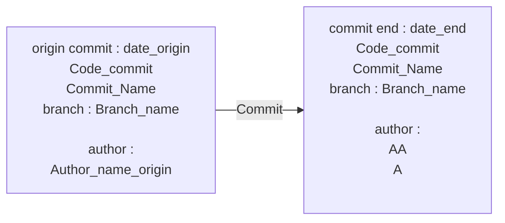

# App_1 Title_1
___
## Commit

 

[Back to home](./../../../Readme.md)

___
## Introduction
### Description

Pokemon 

 

### Acceptannce & Criteria

- test 

 

### User stories

|User Stories|Owner|Status|Description User Stories|
|---|---|---|---|
|story 1 app1  |AA  |  |  |
|story2 app 1  |A  |  |  |

 

___
## story 1 app1
### Technical Explaination

Expand Technical documentation

test

 

### Conclusion

 

___
## story2 app 1
### Technical Explaination

Expand Technical documentation

test

 

### Conclusion

 

___
<link rel="stylesheet" href="./../../../style.css">