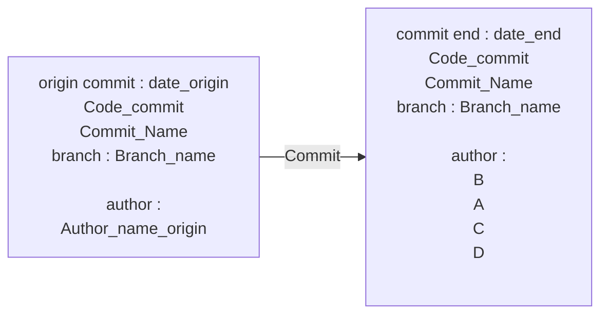

# App_1 Title_2
___
## Commit

 

___
## Introduction
### Description

description app1 title2 : Hello world! 

 

### Acceptannce & Criteria

- hello world ! 

 

### User stories

|User Stories|Owner|Status|Description User Stories|
|---|---|---|---|
|story 1 app1  |B  |  |  |
|story2 app 1  |A  |  |  |
|story3 app 1  |C  |  |  |
|story4 app1  |D  |  |  |
|story5 app1  |D  |  |  |

 

___
## story 1 app1
### Technical Explaination

Expand Technical documentation

test

 

### Conclusion

 

___
## story2 app 1
### Technical Explaination

Expand Technical documentation

test

 

### Conclusion

 

___
## story3 app 1
### Technical Explaination

Expand Technical documentation

test

 

### Conclusion

 

___
## story4 app1
### Technical Explaination

Expand Technical documentation

test

 

### Conclusion

 

___
## story5 app1
### Technical Explaination

Expand Technical documentation

test

 

### Conclusion

 

___
<link rel="stylesheet" href="./../../../style.css">