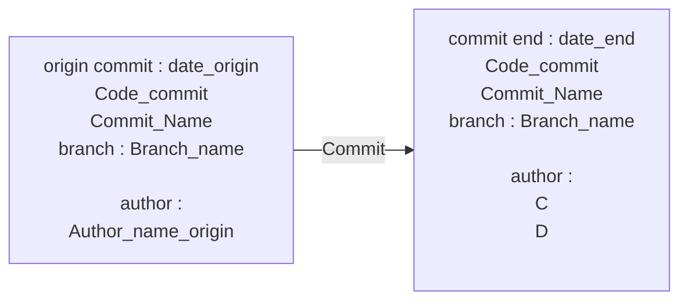

# App_2 Title1
___
## Commit

 

___
## Introduction
### Description

description for fun ! 

 

### Acceptannce & Criteria

- 

 

### User stories

|User Stories|Owner|Status|Description User Stories|
|---|---|---|---|
|story 1 app2  |C  |  |  |
|story 2 app 2  |C  |  |  |
|story 3 app 2  |D  |  |  |
|story 4 app 2  |C  |  |  |

 

___
## story 1 app2
### Technical Explaination

Expand Technical documentation

test

 

### Conclusion

 

___
## story 2 app 2
### Technical Explaination

Expand Technical documentation

test

 

### Conclusion

 

___
## story 3 app 2
### Technical Explaination

Expand Technical documentation

test

 

### Conclusion

 

___
## story 4 app 2
### Technical Explaination

Expand Technical documentation

test

 

### Conclusion

 

___
<link rel="stylesheet" href="./../../../style.css">