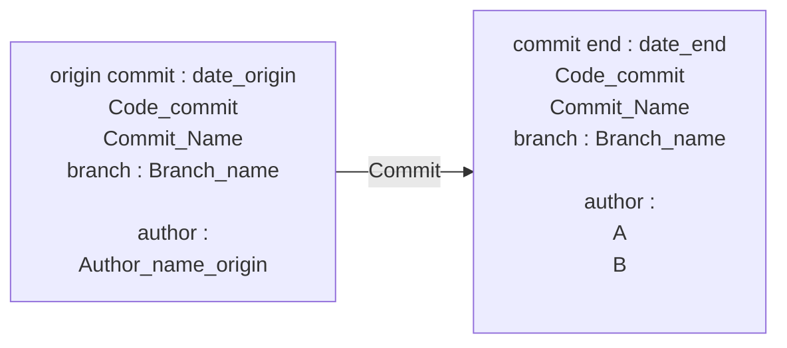

# App_3 Title_1
___
## Commit

 

[Back to home](./../../../Readme.md)

___
## Introduction
### Description

description app3 title2 : Hello Jonh! 

 

### Acceptannce & Criteria

- 

 

### User stories

|User Stories|Owner|Status|Description User Stories|
|---|---|---|---|
|story 1 app3  |A  |  |  |
|story 2 app3  |A  |  |  |
|story 3 app 3  |B  |  |  |

 

___
## story 1 app3
### Technical Explaination

Expand Technical documentation

test

 

### Conclusion

 

___
## story 2 app3
### Technical Explaination

Expand Technical documentation

test

 

### Conclusion

 

___
## story 3 app 3
### Technical Explaination

Expand Technical documentation

test

 

### Conclusion

 

___
<link rel="stylesheet" href="./../../../style.css">