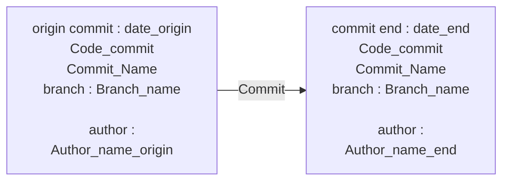

## Commit

```mermaid

graph LR
A[origin commit : date_origin <br> Code_commit <br> Commit_Name <br> branch : Branch_name <br><br> author : <br> Author_name_origin <br>]-->
|Commit|B[commit end : date_end <br> Code_commit <br> Commit_Name <br> branch : Branch_name <br><br> author : <br> Author_name_end <br>]

    click A "http://www.github.com" _blank
    click B "http://www.github.com" _blank
```

 

___
## Introduction
### Description

Description_Insert

 

### Acceptannce & Criteria

- Acceptance&Criteria_insert

 

### User stories

